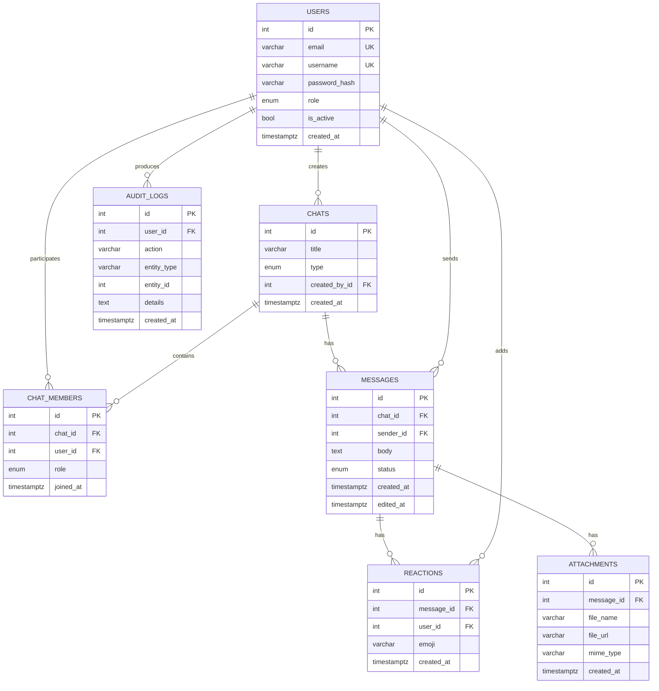

# ER-диаграмма

## Связи

- `users` 1:N `messages` - один пользователь отправляет много сообщений.
- `chats` 1:N `messages` - один чат содержит много сообщений.
- `users` N:N `chats` через `chat_members`.
- `messages` 1:N `reactions`.
- `messages` 1:N `attachments`.
- `users` 1:N `audit_logs`.

