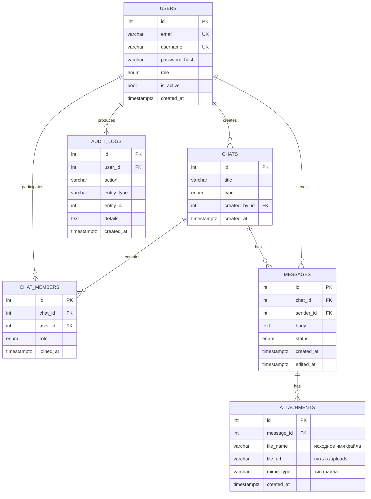

# ER-диаграмма



## Связи

- `users` 1:N `messages` - один пользователь отправляет много сообщений.
- `chats` 1:N `messages` - один чат содержит много сообщений.
- `users` N:N `chats` через `chat_members`.
- `messages` 1:N `attachments` - одно сообщение может иметь несколько файловых вложений.
- `users` 1:N `audit_logs`.

## Вложения сообщений

Для файловых сообщений используется таблица `attachments`. Она связана с `messages` отношением 1:N: одно сообщение может иметь от 0 до 3 вложений. Ограничение на максимум 3 файла проверяется на уровне API и клиентского интерфейса.

Актуальные поля таблицы:

```text
id          - первичный ключ
message_id  - ссылка на сообщение
file_name   - исходное имя файла
file_url    - путь к сохраненному файлу, например /uploads/<stored_name>
mime_type   - MIME-тип файла
created_at  - дата добавления вложения
```

Файл хранится в каталоге приложения `app/uploads`, а в базе данных сохраняются только метаданные и ссылка. При добавлении сообщения в «Избранное» создается копия записи сообщения и копируются связанные записи `attachments`, поэтому файловые сообщения сохраняют вложения и в личном архиве пользователя.

## Как файловое сообщение отражается в модели

1. Пользователь загружает файл через API.
2. Сервер сохраняет файл в `app/uploads`.
3. В таблицу `messages` добавляется запись сообщения.
4. Для каждого прикрепленного файла создается запись в `attachments` с `message_id`.
5. При удалении сообщения вложения удаляются каскадно через связь `attachments.message_id -> messages.id`.
